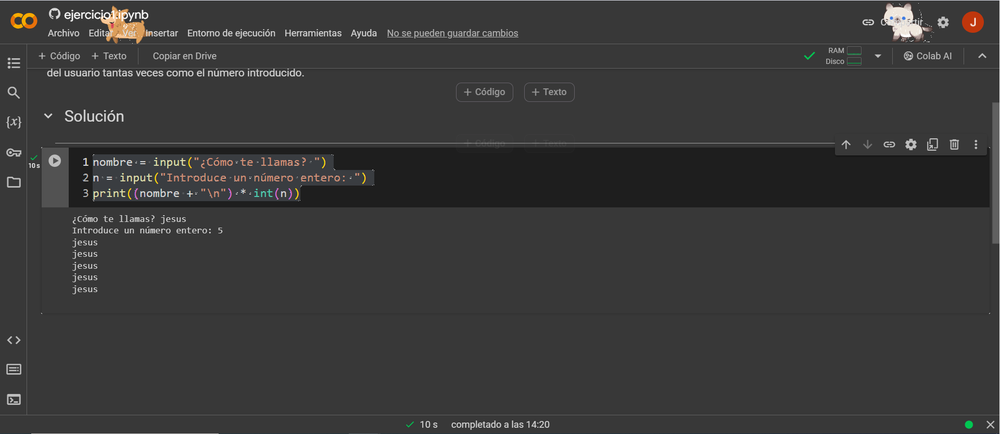

# Python_Colab PROYECTO 2

nombre = input("¿Cómo te llamas? ")
n = input("Introduce un número entero: ")
print((nombre + "\n") * int(n))

¿Cómo te llamas? jesus
Introduce un número entero: 5
jesus
jesus
jesus
jesus
jesus

### LINK PARA IR A GOOGLE COLAB

https://colab.research.google.com/?hl=es

