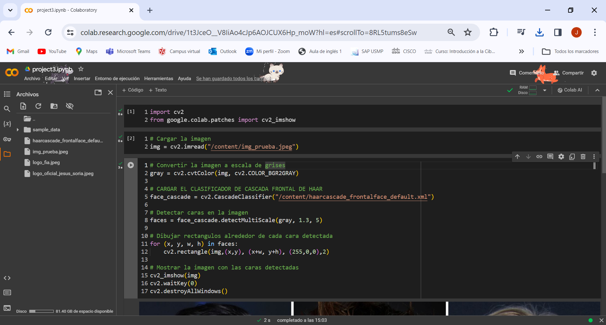

# Python_Colab PROYECTO 3

### CODIGO DE PYTHON DE UN REPOSITORIO

https://github.com/xabier06?tab=repositories&q=&type=&language=&sort=

### VIDEO DEL PROYECTO

https://www.youtube.com/watch?v=8Sm9BzlwSDQ&ab_channel=Dr.Xabi

#### LINK PARA OBTENER UN ARCHIVO XML

https://github.com/kipr/opencv/blob/master/data/haarcascades/haarcascade_frontalface_default.xml

